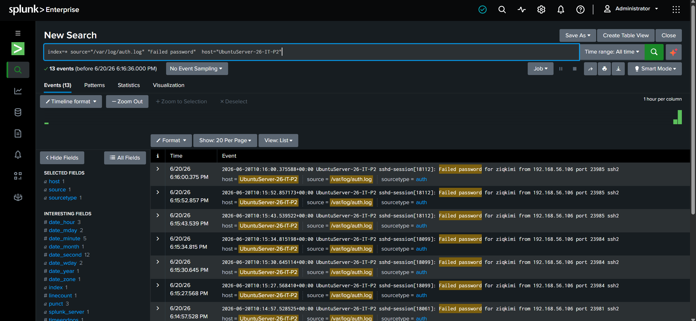
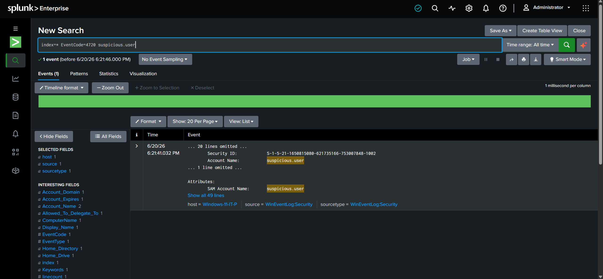

# Incident Report — IR-001
**Date:** 20/6/2026
**Severity:** Medium
**Status:** Resolved

## Summary
A brute force SSH attack was detected against the Ubuntu Server, originating from the host machine (192.168.0.5). Immediately following the attack, a suspicious local user account (suspicious.user) was created on the Windows Server. Both events were detected via Splunk Enterprise monitoring and contained within 10 minutes.

## Timeline
- 18:15 — First failed SSH login attempt detected in /var/log/auth.log
- 18:16–18:18 — Repeated failed SSH attempts from source IP 192.168.0.5 (5–6 attempts)
- 18:21 — suspicious.user account created on Windows Server (EventCode 4720)
- 18:22 — Splunk searches run; investigation began
- 18:25 — Source IP blocked via UFW on Ubuntu; suspicious user account deleted

## Detection
Brute Force Detection:
- Splunk Search: index=* source="/var/log/auth.log" "Failed password" | stats count by host
- Result: Showed 5 failed attempts aggregated from source IP 192.168.0.5

Unauthorized User Creation Detection:
- Splunk Search: index=* EventCode=4720 suspicious.user
- Result: Account suspicious.user was created by ziqkimi on Windows-11-IT-P at 6:21:41 PM

## Evidence
- Screenshot 1: Splunk aggregation showing count of failed SSH attempts from 192.168.0.5.

- Screenshot 2: Splunk event details for EventCode 4720, showing the new account suspicious.user and the creator ziqkimi.

## Root Cause
- SSH on the Ubuntu VM was exposed to the local network with password authentication enabled.
- No brute-force protection (e.g., fail2ban) was in place on Ubuntu.
- Windows Server did not have strict policies restricting local user creation, allowing suspicious.user to be created without approval.

## Response Actions
1. Blocked the attacking IP on Ubuntu:
   sudo ufw deny from 192.168.0.5

2. Deleted the suspicious user account on Windows Server:
   net user suspicious.user /delete

3. Reviewed /var/log/auth.log for the past 24 hours — confirmed no successful unauthorized logins.

4. Verified Windows Security logs — confirmed no other unauthorized accounts were created.

## Recommendations
- Implement fail2ban on Ubuntu to auto-block IPs after multiple failed SSH attempts.
- Restrict SSH to key-based authentication only — disable password authentication.
- Enable Windows account creation alerts with a proper approval workflow.
- Review firewall rules quarterly to ensure only necessary ports are exposed.
