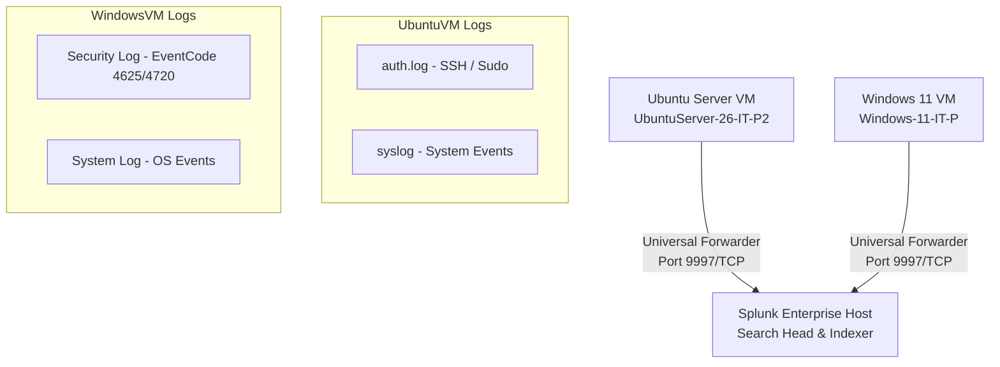

# SIEM Implementation and Splunk Setup Report

## Overview

A **SIEM (Security Information and Event Management)** system is a critical component of security operations. It provides centralized log aggregation, real-time security monitoring, query-based analysis, and historical compliance reporting.

This report documents the deployment of **Splunk Enterprise** (Indexer & Search Head) on the host machine and the installation of **Splunk Universal Forwarders** on the **Ubuntu Server (UbuntuServer-26-IT-P2)** and **Windows 11 Client (Windows-11-IT-P)** VMs to collect, index, and analyze security logs.

---

## 1. Network Log Collection Architecture

The diagram below outlines the log pipeline established in this lab:



---

## 2. Installing and Configuring the Splunk Indexer

1. **Deployment**: Splunk Enterprise was installed on the host machine. The management dashboard was accessed via `http://localhost:8000`.
2. **Enable Receiving Port**: Configured Splunk to listen for incoming logs from forwarding clients on TCP port `9997`:
   - Navigate to **Settings** → **Forwarding and Receiving** → **Receive Data** → **Configure Receiving**.
   - Click **New Receiving Port** and add port `9997`.

---

## 3. Configuring the Ubuntu Forwarder

The **Splunk Universal Forwarder** was installed on the Ubuntu VM to ship system logs to the Indexer.

### Command Execution Steps:

1. **Download and Install**:
   ```bash
   wget -O splunkforwarder.deb "https://download.splunk.com/products/universalforwarder/releases/9.1.0/linux/splunkforwarder-9.1.0-amd64.deb"
   sudo dpkg -i splunkforwarder.deb
   ```
2. **Start and Accept License**:
   ```bash
   sudo /opt/splunkforwarder/bin/splunk start --accept-license
   ```
3. **Configure Forwarding Server**:
   Set the destination to the Splunk Indexer IP address on port `9997`:
   ```bash
   sudo /opt/splunkforwarder/bin/splunk add forward-server 192.168.0.5:9997
   ```
4. **Monitor System Log Paths**:
   Told the forwarder to track authentication logs and system messages:
   ```bash
   sudo /opt/splunkforwarder/bin/splunk add monitor /var/log/auth.log
   sudo /opt/splunkforwarder/bin/splunk add monitor /var/log/syslog
   ```

---

## 4. Configuring the Windows 11 Forwarder

The Splunk Universal Forwarder for Windows was installed on **Windows-11-IT-P** and configured to collect native Windows Event logs.

1. **Service Setup**: Ran the installer and set the destination indexer to `192.168.0.5:9997`.
2. **Channel Selection**: Configured the forwarder to capture the following Event Log channels:
   - **Security**: Contains logins, privilege adjustments, and user account creation events.
   - **System**: Tracks OS reboots, driver failures, and service status updates.

---

## 5. Structured Splunk Searches & Reports

Once logs were ingestion-ready, customized search queries were constructed in the Search app and saved as reports for active monitoring.

### Report 1: Ubuntu Failed SSH Attempts

- **Use Case**: Detect active brute-force or credential-stuffing attacks against SSH.
- **Search Query**:
  ```splunk
  index=* source="/var/log/auth.log" "Failed password" | stats count by host, user, rhost
  ```
- **Analysis**: Filters authentication logs for the string "Failed password" and aggregates the count by target hostname (`host`), target username (`user`), and the attacking IP (`rhost`).

### Report 2: Windows Failed Logon Events

- **Use Case**: Detect unauthorized access attempts, failed RDP logins, or system password spraying.
- **Search Query**:
  ```splunk
  index=* EventCode=4625 | stats count by TargetUserName, IpAddress, SubStatus
  ```
- **Analysis**: **Event ID 4625** represents a failed Windows logon. This query extracts the targeted username, source IP, and Windows Sub-Status error code to diagnose if the failure was due to an invalid password, bad username, or expired account.

### Report 3: Windows Local User Account Creation

- **Use Case**: Detect backdoor account creation and unauthorized persistence by adversaries.
- **Search Query**:
  ```splunk
  index=* EventCode=4720 | table _time, ComputerName, TargetUserName, SubjectUserName
  ```
- **Analysis**: **Event ID 4720** is triggered whenever a new user account is created. This table displays the timestamp, machine name, the new username (`TargetUserName`), and the account that created it (`SubjectUserName`).

---

## 6. Key SIEM Concepts

### What problem does a SIEM solve?

In modern networks, thousands of endpoints, servers, firewalls, and applications generate massive amounts of log data every second. If an attacker breaches the network, finding their footprints across separate machines is impossible.

A SIEM solves this by:

1. **Centralization**: Aggregating logs from Windows, Linux, network devices, and cloud endpoints into a single database.
2. **Correlation**: Analyzing relationships between events. For example, linking a failed login on an email server followed by a successful login from the same IP on an internal database.
3. **Alerting**: Instantly notifying analysts when a specific signature (e.g., EventCode 4720 for new user accounts) or abnormal volume of activities occurs.
4. **Log Retention**: Maintaining log integrity for compliance audits and forensic analysis.
